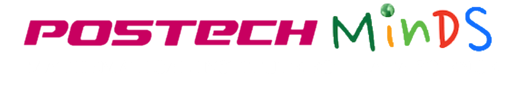

# Tutorial for TDA and Machine Learning in PNU.

본 자료는 2023년 1월 16일 - 17일 양일간 진행된 **부산대학교 수학과 빅데이터 기반 미래 교육 인재 양성 프로그램**(주최 : 부산대학교 빅데이터 기반 금융 수산 제조 혁신 산업수학센터)에서 시연될 TDA 튜토리얼을 위한 자료입니다.

튜토리얼 자료 사용법은 다음과 같습니다.

1. 우측 상단의 초록색 `< > Code` 버튼을 누릅니다.
2. `Download ZIP` 버튼을 눌러 자료를 다운받습니다. 
3. 다운로드받은 자료의 압축을 풀고, `tutorial.ipynb` (또는 `tutorial_hands_on.ipynb`) 파일을 엽니다.
4. 노트북 `tutorial.ipynb`의 제일 처음 셀에 있는 명령어 `!pip install -r requirements.txt`를 실행하면 튜토리얼 진행에 필요한 모든 라이브러리가 설치됩니다.
5. 위 명령어에서 에러가 발생하는 경우 다음의 절차를 따르세요.
   1. 에러 메시지를 읽고 설치에 오류가 발생하는 라이브러리를 살펴봅니다.
   2. 해당 라이브러리를 아래 목록에서 찾아 주석표시 '#'을 지우고 이 셀을 실행시킵니다.
   3. 이렇게 했는데도 오류가 발생하는 경우 !pip install 대신 !conda install 로 바꾸어서 실행시켜봅니다. 

기타 문의사항은 [shlee0125@postech.ac.kr] 로 문의주세요.

감사합니다.

제작자 : 이성헌 (포항공과대학교 인공지능대학원 박사과정)

